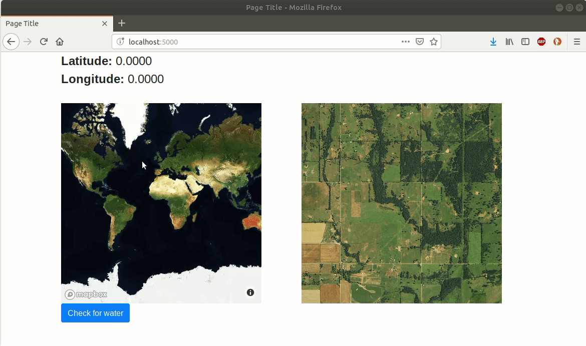

# IsThisWater

_IsThisWater_ is a web app that detects the existence of any surface water (rivers, lakes, oceans, etc.) within a square satellite image of the surface of the Earth.

## Background

One of the most important concerns with climate change is the increasing scarcity of freshwater sources. One of the ways that technology can be used to mitigate this problem is understanding where and how much water exists on the surface of the Earth. Convolutional neural networks have been used successfully in the past to identify and map surface water from Landsat images, as explained in studies like <a href="https://www.tandfonline.com/doi/pdf/10.1080/17538947.2015.1026420?needAccess=true&">this</a> and <a href="http://live.ece.utexas.edu/publications/2017/isikdogan2017surface.pdf">this</a>.

This project is a work in progress:

- [x] Create data labelling app
- [x] Create water detection frontend
- [ ] Label 2000-3000 images
- [ ] Build convnet model
- [ ] Perform data augmentation and train model on the images
- [ ] Connect frontend with model prediction endpoint in backend

## Installation

1. Clone the repo.
2. Run `pipenv install` inside the cloned repo.

## How to use the data labelling app

1. Run [`get_site_data_from_cities.ipynb`](data_labelling/notebooks/get_site_data_from_cities.ipynb) to collect geographical coordinates for random sites located near [select U.S. cities](data_labelling/json/cities.json).

2. Run [`download_base_images.ipynb`](data_labelling/notebooks/download_base_images.ipynb) to download satellite images from Mapbox at zoom level 15 for each of the sites. The images are saved locally at the location dictated by the `BASE_IMAGES_DIRECTORY` variable.

3. Run [`data_labelling/app.py`](data_labelling/app.py) with Python 3 to open the data labelling app at `localhost:5000`. The app will automatically load each image using an iterator in the backend.

4. For each image, click either "No", "Yes", or "Ignore" to label the image. The image will be moved to the appropriate folder inside the [`static`](data_labelling/static) folder, and the next image will load.

5. To zoom in or out, use the corresponding buttons, and the base image (at zoom level 15) will be replaced by an image at the correct zoom level.

6. Close the app when all the images are labelled.

## How to use the water detection app
#### (This is just a skeleton for the frontend. It is in development and is not connected to the backend. The image classification result is generated randomly.)
1. Scroll/zoom to a location on the Earth using an interactive map from Mapbox.

2. Click Detect Water.

3. The neural network will classify the image as "Water" or "No Water" and return the result. 
